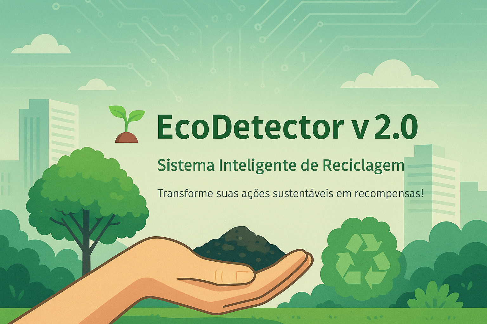
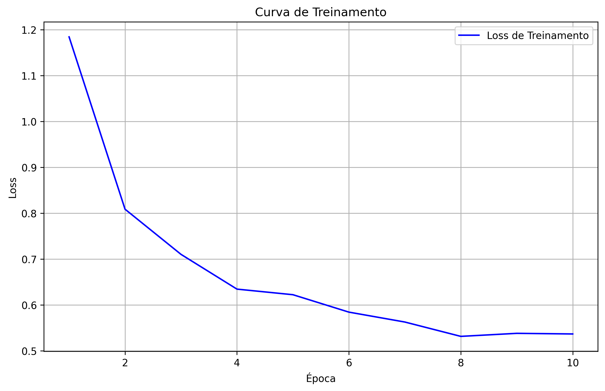
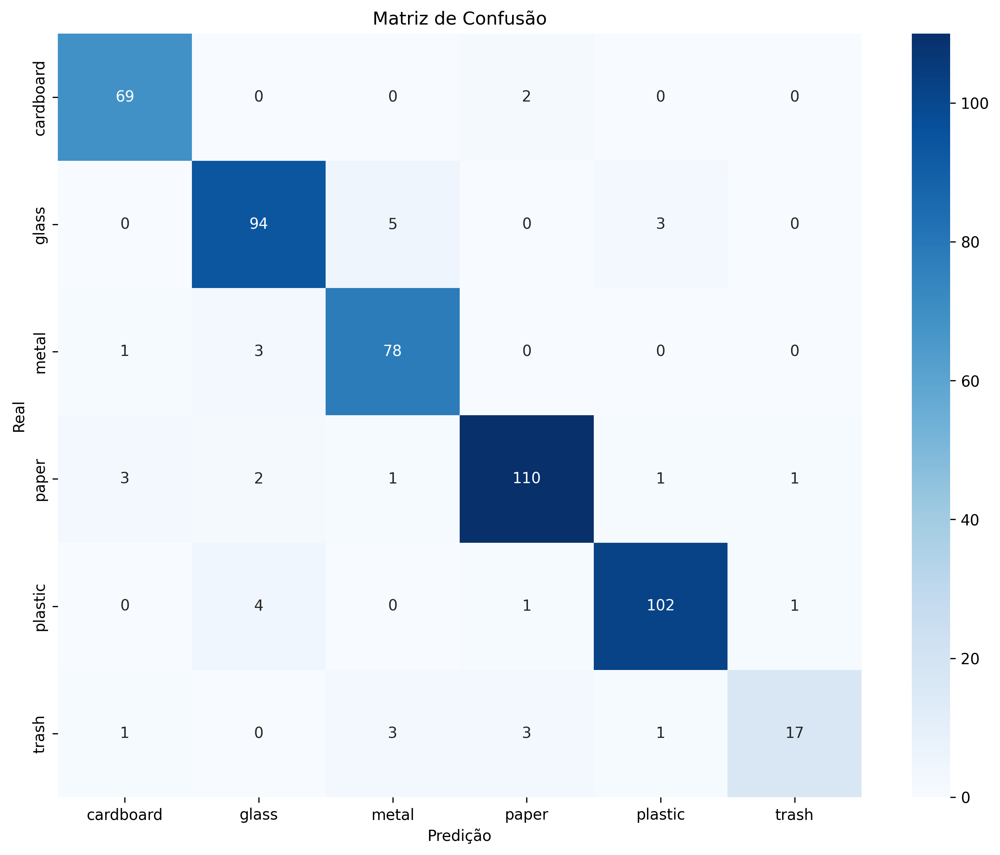

# 🌱 EcoDetector v2.0 — Classificação Inteligente de Resíduos



## 📋 Índice

- [Sobre o Projeto](#sobre-o-projeto)
- [Tecnologias Utilizadas](#tecnologias-utilizadas)
- [Funcionalidades](#funcionalidades)
- [Arquitetura e Design](#arquitetura-e-design)
- [Modelo de IA](#modelo-de-ia)
- [Resultados e Métricas](#resultados-e-métricas)
- [Interface do Usuário](#interface-do-usuário)
- [Instalação e Uso](#instalação-e-uso)
- [Estrutura do Projeto](#estrutura-do-projeto)
- [Próximos Passos](#próximos-passos)
- [Desenvolvedor](#desenvolvedor)

## 📌 Sobre o Projeto

O **EcoDetector v2.0** é um sistema inteligente de classificação de resíduos recicláveis que utiliza **Visão Computacional** e **Inteligência Artificial** para promover o descarte correto de materiais. O projeto combina tecnologia de ponta com uma interface gamificada para educação ambiental, tornando o processo de reciclagem mais acessível e envolvente.

### 🎯 Objetivos

- Classificar automaticamente resíduos em 6 categorias distintas
- Promover consciência ambiental através de gamificação
- Fornecer informações educativas sobre reciclagem
- Facilitar o acesso a pontos de coleta na região

### 🏆 Propósito Acadêmico

Este projeto foi desenvolvido como parte do **Trabalho 2 - Inteligência Artificial 2025/01** da disciplina de IA da Faculdade Antonio Meneghetti (AMF), seguindo a **Opção 1: Criação de modelo com dataset**, utilizando redes neurais para classificação de imagens.

## 🧰 Tecnologias Utilizadas

### 📚 Bibliotecas de IA e Machine Learning

| Biblioteca | Função Principal | Versão |
|------------|------------------|---------|
| **PyTorch** | Framework principal para criação e treinamento da rede neural | Latest |
| **TorchVision** | Pré-processamento de imagens e carregamento de datasets | Latest |
| **EfficientNet** | Arquitetura base do modelo (EfficientNetB0) | - |
| **Scikit-learn** | Métricas de avaliação (accuracy, F1-score, matriz de confusão) | Latest |
| **NumPy** | Operações matemáticas e manipulação de arrays | Latest |
| **Pandas** | Manipulação de dados tabulares | Latest |

### 🎨 Interface e Visualização

| Tecnologia | Aplicação |
|------------|-----------|
| **Streamlit** | Framework para criação da interface web interativa |
| **Plotly** | Gráficos interativos e visualizações dinâmicas |
| **PyDeck** | Mapas interativos com pontos de coleta |
| **Matplotlib** | Geração de gráficos estáticos (curvas de treinamento) |
| **Seaborn** | Visualização da matriz de confusão |
| **PIL (Pillow)** | Processamento e manipulação de imagens |
| **CSS customizado** | Estilo visual com glassmorphism e animações |

## 🔧 Funcionalidades

### 🤖 Inteligência Artificial
- **Classificação automática** de resíduos em 6 categorias:
  - 📄 `paper` (Papel)
  - 🥤 `plastic` (Plástico)
  - 🔧 `metal` (Metal)
  - 🍶 `glass` (Vidro)
  - 📦 `cardboard` (Papelão)
  - 🗑️ `trash` (Lixo comum)

- **Sistema de confiança** com detecção de outliers
- **Análise de certeza** das predições
- **Processamento em tempo real** de imagens

### 🎮 Gamificação
- **EcoMoedas** como sistema de recompensas
- **Sistema de medalhas** e conquistas
- **Ranking** de usuários
- **Níveis de progresso** baseados em atividade
- **Dashboard personalizado** com impacto ambiental

### 📊 Visualizações
- **Gráficos interativos** de desempenho
- **Mapa interativo** com pontos de coleta no RS
- **Estatísticas em tempo real** do usuário
- **Curvas de treinamento** do modelo
- **Matriz de confusão** para análise técnica

## 🏗️ Arquitetura e Design

### 📈 Evolução do Projeto

| Aspecto | Versão Inicial | Versão Final (v2.0) | Melhoria |
|---------|----------------|---------------------|----------|
| **Linhas de Código** | ~45 | 200+ | +340% |
| **Arquitetura** | Monolítica | Modular (7 funções) | ✅ Estruturada |
| **Métricas** | Apenas Loss | Accuracy, F1, por classe | ✅ Completa |
| **Visualização** | Nenhuma | Gráficos, Matriz, Curvas | ✅ Rica |
| **Interface** | Inexistente | Responsiva e interativa | ✅ Profissional |

### 🎨 Design da Interface
- **Design responsivo** com CSS moderno
- **Navegação intuitiva** com sidebar
- **Drag-and-drop** para upload de imagens
- **Feedback visual** com emojis e animações
- **Tema consistente** com foco ambiental

## 🧠 Modelo de IA

### 🔬 Arquitetura Técnica

- **Modelo Base**: EfficientNetB0 (pré-treinado)
- **Técnica**: Transfer Learning com Fine-tuning
- **Framework**: PyTorch
- **Otimizador**: Adam
- **Função de Perda**: CrossEntropyLoss
- **Divisão dos Dados**: 80% treino / 20% teste

### 📊 Pipeline de Treinamento

1. **Pré-processamento**:
   - Redimensionamento para 224x224 pixels
   - Normalização com valores ImageNet
   - Data augmentation (rotação, flip, zoom)

2. **Treinamento**:
   - Fine-tuning das camadas finais
   - Monitoramento de overfitting
   - Early stopping baseado em validação

3. **Validação**:
   - Avaliação com dados separados
   - Métricas múltiplas (Accuracy, F1, Precisão, Recall)
   - Análise por classe individual

## 📈 Resultados e Métricas

### 🎯 Performance do Modelo

| Métrica | Valor Inicial | Valor Final | Melhoria |
|---------|---------------|-------------|----------|
| **Acurácia** | 79.45% | 88.54% | +9.09% |
| **F1-Score** | 0.79 | 0.88 | +0.09 |
| **Precisão Média** | 0.78 | 0.87 | +0.09 |
| **Recall Médio** | 0.79 | 0.88 | +0.09 |

### 📊 Análise Detalhada



**Principais Conquistas**:
- ✅ Redução significativa de overfitting
- ✅ Melhoria nas classes `plastic` e `trash`
- ✅ Estabilização da curva de validação
- ✅ Balanceamento entre precisão e recall

### 🔍 Matriz de Confusão



A matriz de confusão revela:
- **Diagonal principal forte**: Boa classificação geral
- **Confusões mínimas** entre classes similares
- **Identificação precisa** de resíduos problemáticos

## 💻 Interface do Usuário

### 🎪 Páginas Principais

1. **🔍 Detector**
   - Upload de imagens via drag-and-drop
   - Classificação em tempo real
   - Recomendações de descarte
   - Curiosidades sobre o material

2. **📊 Dashboard**
   - Estatísticas pessoais
   - Progresso de EcoMoedas
   - Impacto ambiental calculado
   - Gráficos de atividade

3. **🗺️ Mapa**
   - Pontos de coleta no RS
   - Filtros por tipo de material
   - Informações de contato
   - Rotas otimizadas

4. **🏆 Ranking**
   - Classificação de usuários
   - Sistema de medalhas
   - Conquistas desbloqueadas
   - Competições mensais

### 🎨 Características Visuais

- **Glassmorphism**: Efeitos de vidro translúcido
- **Animações CSS**: Transições suaves
- **Cores ambientais**: Paleta verde sustentável
- **Tipografia moderna**: Fonts legíveis e atrativas
- **Responsividade**: Adaptação a diferentes dispositivos

## 🚀 Instalação e Uso

### 📋 Pré-requisitos

```bash
Python 3.8+
pip (gerenciador de pacotes)
```

### 🔧 Instalação

```bash
# Clone o repositório
git clone https://github.com/seu-usuario/ecodetector-v2.git
cd ecodetector-v2

# Instale as dependências
pip install -r requirements.txt

# Execute a aplicação
streamlit run completo.py
```

### 📦 Dependências Principais

```txt
streamlit>=1.28.0
torch>=2.0.0
torchvision>=0.15.0
scikit-learn>=1.3.0
matplotlib>=3.6.0
seaborn>=0.12.0
pandas>=1.5.0
numpy>=1.24.0
plotly>=5.15.0
pydeck>=0.8.0
Pillow>=9.5.0
```

### 🎯 Como Usar

1. **Abra a aplicação** no navegador (geralmente http://localhost:8501)
2. **Navegue até "Detector"** na barra lateral
3. **Faça upload de uma imagem** de resíduo
4. **Visualize o resultado** da classificação
5. **Siga as recomendações** de descarte
6. **Explore o dashboard** para ver seu progresso

## 📁 Estrutura do Projeto

```
ecodetector-v2/
├── 📄 completo.py              # Aplicação principal Streamlit
├── 🤖 modelo_oikos.pt          # Modelo treinado (pesos)
├── 📊 requirements.txt         # Dependências do projeto
├── 📋 README.md               # Este arquivo
├── 🖼️ assets/                  # Recursos visuais
│   ├── tela_inicial.png
│   ├── confusion_matrix.png
│   ├── training_curve.png
│   └── feature_importance.png
├── 📚 docs/                   # Documentação adicional
│   ├── analise_predicoes_final.png
│   └── prompt_inicial.txt
└── 🧪 notebooks/             # Notebooks de desenvolvimento
    └── experimentos.ipynb
```

## 🔮 Próximos Passos

### 🎯 Melhorias Planejadas

- [ ] **Expansão de categorias**
  - Baterias e pilhas
  - Equipamentos eletrônicos
  - Materiais orgânicos
  - Materiais perigosos

- [ ] **Funcionalidades avançadas**
  - Reconhecimento via vídeo em tempo real
  - API para integração externa
  - Modo offline para dispositivos móveis
  - Suporte a múltiplas linguagens

- [ ] **Infraestrutura**
  - Deploy em nuvem (AWS/Azure)
  - Cache de usuários persistente
  - Sistema de autenticação
  - Banco de dados para histórico

- [ ] **Pesquisa e dados**
  - Coleta de dados anonimizados
  - Análise de padrões regionais
  - Relatórios de impacto ambiental
  - Parcerias com cooperativas

### 📊 Métricas Futuras

- Aumentar acurácia para 95%+
- Reduzir tempo de inferência para <1s
- Expandir dataset para 100k+ imagens
- Implementar detecção de múltiplos objetos

## 🎓 Aprendizados e Desafios

### 🧠 Conhecimentos Adquiridos

- **Transfer Learning**: Aplicação prática de modelos pré-treinados
- **Fine-tuning**: Ajuste de hiperparâmetros para domínio específico
- **Avaliação de modelos**: Métricas além da acurácia
- **Interface web**: Desenvolvimento com Streamlit
- **Gamificação**: Engajamento através de elementos lúdicos

### 🚧 Desafios Superados

- **Overfitting**: Controlado com data augmentation e regularização
- **Desbalanceamento**: Mitigado com técnicas de balanceamento
- **Performance**: Otimização de inferência para tempo real
- **UX/UI**: Criação de interface intuitiva e atrativa

## 🌍 Impacto Ambiental

### 📈 Benefícios Esperados

- **Educação**: Conscientização sobre reciclagem correta
- **Eficiência**: Redução de contaminação em materiais recicláveis
- **Acessibilidade**: Informações sobre pontos de coleta
- **Engajamento**: Gamificação para incentivar boas práticas

### 🎯 Público-Alvo

- Estudantes e educadores
- Famílias conscientes
- Organizações ambientais
- Cooperativas de reciclagem
- Gestores públicos

## 👨‍💻 Desenvolvedor

**Nome**: Nicolas França
**Curso**: Sistemas de Informação  
**Instituição**: Faculdade Antonio Meneghetti (AMF)  
**Disciplina**: Inteligência Artificial 2025/01  

### 📞 Contato

- **Email**: [nicolasdifranc@gmail.com]
- **LinkedIn**: [https://www.linkedin.com/in/nicolas-fran%C3%A7a-3235a221a/]
- **GitHub**: [https://github.com/Nico-Draagron/EcoIA]

### 🏆 Reconhecimentos

- Trabalho desenvolvido como parte da disciplina de IA
- Aplicação de conceitos de IA para impacto social
- Contribuição para educação ambiental
- 3° no Code race, onde foi desenvolvido a primeira versão
  
---

## 📝 Licença

Este projeto foi desenvolvido para fins acadêmicos e educacionais. 

**Desenvolvido com 💚 para um mundo mais sustentável - 2025**

---

*⚡ Tecnologia + 🌱 Meio Ambiente = 🌍 Futuro Sustentável*
